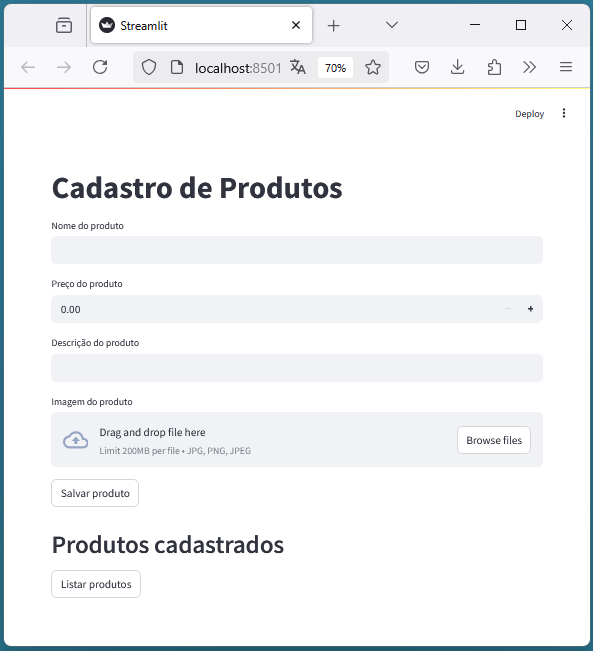

# Microsoft Azure Cloud Native
## Armazenando dados de um E-Commerce na Cloud 
#### Configurando o Banco de Dados e Criando a Tabela de Produtos 

> [!NOTE]
> Verificar o ambiente, Python3

## Necessário ter um arquivo .env
```
BLOB_CONNECTION_STRING = "DefaultEndpointsProtocol=*;AccountName=*;AccountKey=*;EndpointSuffix=*"
BLOB_CONTAINER_NAME = "*"
BLOB_ACCOUNT_NAME = "*"

SQL_SERVER = "*"
SQL_DATABASE = "*"
SQL_USER = "*"
SQL_PASSWORD = "*"
```
Algumas destas informações devem são provenientes de :
>Resource visualizer
>> Settings
>>>   Connection strings


## Caso seja necessário atualizar a versão do Python
```bash
python3 -m pip install --upgrade pip
```

## Recurso necessário para o programa ler o arquivo .env de configuração
```bash
python -m pip install python-dotenv
```

## Instalar todas as bibliotecas listadas no arquivo requirements.txt
```bash
python3 -m pip install -r requirements.txt
```

## Para rodar o programa
```bash
streamlit run main.py
```
Isto abrirá o browser


          

